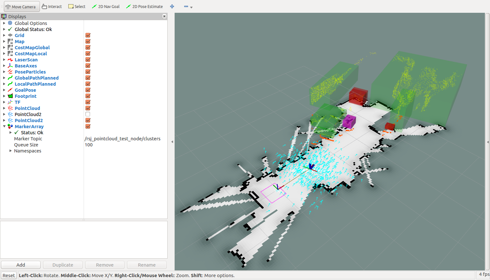

- Table of contents
{:toc}

# 点群処理とロボットナビゲーションの統合

PCL のクラスタリング結果を`rsj_robot_test_node`で利用してみましょう。

## rsj_robot_test.cpp の編集

テキストエディタで`rsj_robot_test.cpp`を開いてください。

```shell
$ cd ~/catkin_ws/src/rsj_robot_test/src
任意のテキストエディタで rsj_robot_test.cpp を開く
```

先頭に`visualization_msgs::MarkerArray`を扱うための`include`文を加えます。

```c++
#include <tf/transform_datatypes.h>
#include <visualization_msgs/MarkerArray.h>
```

`CMakeLists.txt`を編集します。

```shell
$ cd ~/catkin_ws/src/rsj_robot_test
任意のテキストエディタで CMakeLists.txt を開く
```

`find_package`のところに`visualization_msgs`を追記します。

```c++
find_package(catkin REQUIRED COMPONENTS roscpp std_msgs nav_msgs geometry_msgs sensor_msgs tf visualization_msgs)
```

一旦ビルドし、コンパイルエラーがないことを確認してください。

```shell
$ cd ~/catkin_ws
$ catkin_make
```

## クラスタリング結果の受信

`rsj_robot_test_node`で、`sub_odom`や`sub_scan`を定義しているところに、`visualization_msgs::MarkerArray`用のサブスクライバクラスを追加します。

```c++
    ros::Subscriber sub_scan;
    ros::Subscriber sub_clusters;
```

`rsj_robot_test_node`のコンストラクタに、`visualization_msgs::MarkerArray`用のサブスクライバ初期化コードを追加します。

```c++
    rsj_robot_test_node()
    {
略
        sub_scan = nh.subscribe("/scan", 5, &rsj_robot_test_node::cb_scan, this);
        sub_clusters = nh.subscribe("/rsj_pointcloud_test_node/clusters", 5, &rsj_robot_test_node::cb_cluster, this);
```

更に、`rsj_robot_test_node`クラスに、`visualization_msgs::MarkerArray`用のコールバック関数を追加します。(`cb_scan`の後の位置など)

```c++
    void cb_cluster(const visualization_msgs::MarkerArray::ConstPtr &msg)
    {
        ROS_INFO("clusters: %zu", msg->markers.size());
    }
```

編集が終了したらエディタを閉じてください。

## ビルド＆実行

ターミナルで次のコマンドを実行してください。

```
$ cd ~/catkin_ws
$ catkin_make
```

お手持ちの 3D センサ、およびロボットの USB ケーブルをPCに接続しておきます。

また、ロボットが走り出さないように、電池ボックスのスイッチを OFF にしておいてください。

まずナビゲーションシステムを起動します。
地図を作成した際の初期位置・姿勢と同じようにロボットを置いて、下記のコマンドを実行します。

### URG-04LX-UG01 の場合

```shell
$ cd ~/catkin_ws/
$ source devel/setup.bash
$ roslaunch rsj_seminar_navigation navigation.launch robot_param:=/home/【ユーザ名】/params/rsj-seminar20??.param該当するものに置き換えること
```

### Xtion PRO Live の場合

```shell
$ cd ~/catkin_ws/
$ source devel/setup.bash
$ roslaunch rsj_seminar_navigation xtion_integration.launch robot_param:=/home/【ユーザ名】/params/rsj-seminar20??.param該当するものに置き換えること
```

### YVT-35LX の場合
？？？

## rsj_pointcloud_test_node と rsj_robot_test_node の起動

3次元センサをお持ちの場合は新しいターミナルを開き`rsj_pointcloud_test_node`を起動します。

### Xtion PRO Live の場合

```shell
$ rosrun  rsj_pointcloud_test rsj_pointcloud_test_node _target_frame:=camera_link _topic_name:=/camera/depth_registered/points
[ INFO] [1524040063.315596383]: target_frame='camera_link'
[ INFO] [1524040063.315656650]: topic_name='/camera/depth_registered/points'
[ INFO] [1524040063.320448185]: Hello Point Cloud!
[ INFO] [1524040064.148595331]: points (src: 307200, paththrough: 34350)
```

### YVT-35LX の場合

```shell
$ cd ~/catkin_ws/
$ source devel/setup.bash
$ rosrun rsj_pointcloud_test rsj_pointcloud_test_node _target_frame:= _topic_name:=/????????
```

さらに別のターミナルで`rsj_robot_test_node`を起動します。

```shell
$ rosrun  rsj_robot_test rsj_robot_test_node 
[ INFO] [1523957582.691740639]: Hello ROS World!
[ INFO] [1523957582.991946984]: clusters: 6
[ INFO] [1523957583.091959056]: clusters: 7
[ INFO] [1523957583.191939063]: front-range: 3.178
[ INFO] [1523957583.192001041]: front-range: 3.178
```

`rsj_robot_test_node`側で「[ INFO] [1523957583.091959056]: clusters: 7」のように PCL で処理したクラスタを受信し、その個数を表示できていることが分かります。
また RViz 上では`navigation`用のマップ上に重畳して`PointCloud`のクラスタと、クラスタを囲む直方体が表示されています。



