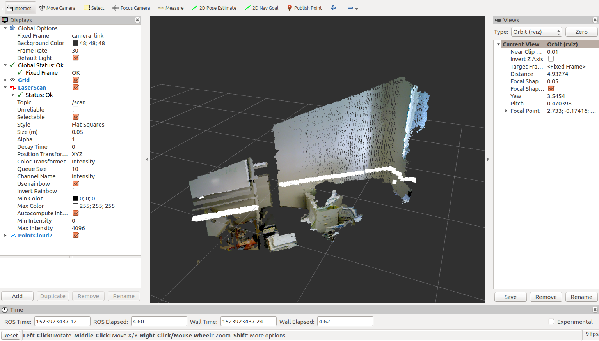
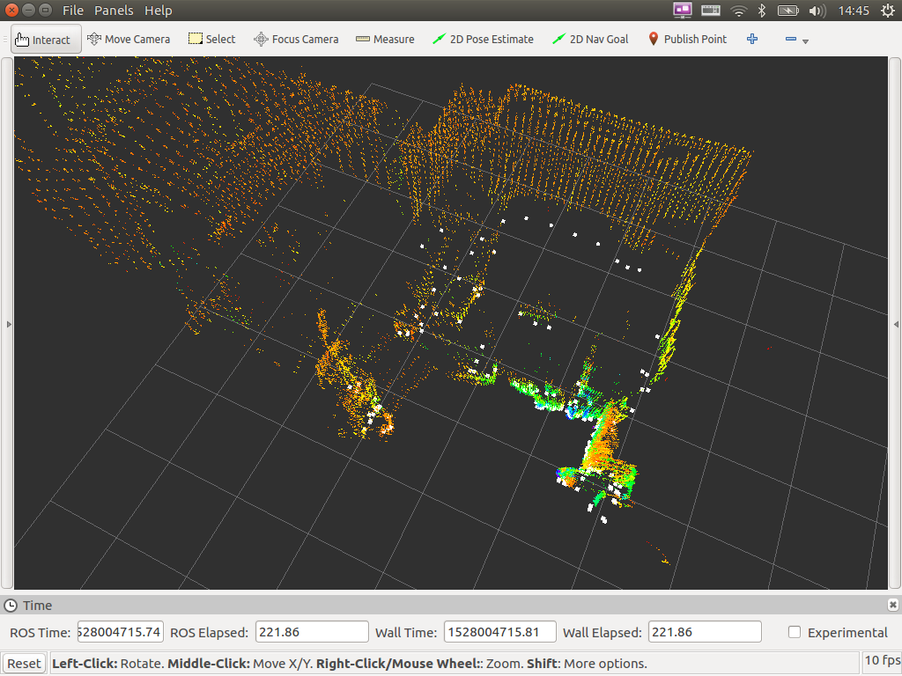

- Table of contents
{:toc}

# 3次元点群の処理

Xtion PRO Live や YVT-35LX から得られる３次元点群`PointCloud`に対する基本的な処理を実習します。

# Point Cloud の表示

各センサから得られる点群を RViz によって可視化します。センサごとに実行するコマンドが異なりますので、お手持ちのセンサに応じて次のコマンドを実行してください。

## Xtion PRO Live の場合

```shell
$ cd ~/catkin_ws/
$ source devel/setup.bash
$ roslaunch rsj_pointcloud_to_laserscan rsj_pointcloud_to_laserscan.launch
```

別のターミナルを開き

```shell
$ cd ~/catkin_ws/src/rsj_pointcloud_to_laserscan/config/rviz
$ rosrun rviz rviz -d view_points.rviz
```

図のように`PointCloud`が表示されれば成功です。



起動した２つのターミナルを __Ctrl+c__{: style="border: 1px solid black" } で終了してください。

## YVT-35LX の場合


```shell
$ cd ~/catkin_ws/
$ source devel/setup.bash
$ roslaunch rsj_pointcloud_to_laserscan rsj_pointcloud_to_laserscan_3durg.launch
```

別のターミナルを開き

```shell
$ cd ~/catkin_ws/src/rsj_pointcloud_to_laserscan/config/rviz
$ rosrun rviz rviz -d view_points_3durg.rviz
```

図のように`PointCloud`が表示されれば成功です。



起動した２つのターミナルを __Ctrl+c__{: style="border: 1px solid black" } で終了してください。

# PCL（Point Cloud Library）による３次元点群処理

ロボットでオドメトリのデータを利用したときと同じように３次元センサが出力した`PointCloud`のデータを受け取るプログラムを作成しましょう。
`PointCloud`の処理を独自に書こうとすると大変な労力が必要です。
２次元画像処理用に[OpenCV](https://opencv.org/)というライブラリがあるように、３次元点群処理には[PCL(Point Cloud Library)](http://pointclouds.org/) があります。
PCL を利用するプログラムを作成してみましょう。

端末を開き雛形をダウンロードしてください。

```shell
$ cd ~/catkin_ws/src
$ git clone https://github.com/KMiyawaki/rsj_pointcloud_test.git
```

テキストエディタで`rsj_pointcloud_test_node.cpp`を開いてください。

```shell
$ cd ~/catkin_ws/src/rsj_pointcloud_test/src
任意のテキストエディタで rsj_pointcloud_test_node.cpp を開く
```

`RsjPointcloudTestNode`クラスにある、`PointCloud`用のコールバック関数`cbPoints`を編集します。

```c++
void cbPoints(const PointCloud::ConstPtr &msg)
{
  try
  {
    (略)
    // ここに cloud_src に対するフィルタ処理を書く
    ROS_INFO("width: %u, height: %u", cloud_src->width, cloud_src->height);
  }
  catch (std::exception &e)
  {
    ROS_ERROR("%s", e.what());
  }
}
```

`cbPoints`関数はセンサから`PointCloud`を受け取るたびに呼び出される関数です。

なお、今回の実習で利用している三次元センサのドライバノードから出力される点群データは、元々は ROS の`sensor_msgs/PointCloud2`という型ですが、後述する`pcl_ros`というライブラリが`PCL`の`PointCloud`型に`sensor_msgs/PointCloud2`型と互換性を持たせる実装を追加することで、特別にそのまま ROS Message 型と同様に使えるようにしています。
サブスクライバの初期化コードで指定するコールバック関数が任意の型を受け取れるわけではないことに注意してください。

ファイルを保存してエディタを閉じます。

# ビルド＆実行

まず、`catkin_ws`で`catkin_make`を実行して、追加したコードをビルドします。

```shell
$ cd ~/catkin_ws
$ catkin_make 
```

次にお手持ちの３次元センサごとに次のようにノードを起動します。

## Xtion PRO Live の場合

ターミナルでセンサドライバノードを起動します。

```shell
$ cd ~/catkin_ws/
$ source devel/setup.bash
$ roslaunch rsj_pointcloud_to_laserscan rsj_pointcloud_to_laserscan.launch
```

新しいターミナルを開き、`rsj_pointcloud_test_node`を起動します。

```shell
$ cd ~/catkin_ws/
$ source devel/setup.bash
$ rosrun  rsj_pointcloud_test rsj_pointcloud_test_node \
    _target_frame:=camera_link _topic_name:=/camera/depth_registered/points
[ INFO] [1524039160.481736901]: target_frame='camera_link'
[ INFO] [1524039160.481783905]: topic_name='/camera/depth_registered/points'
[ INFO] [1524039160.485222004]: Hello Point Cloud!
[ INFO] [1524039161.311438819]: width: 640, height: 480
```

## YVT-35LX の場合

ターミナルでセンサドライバノードを起動します。

```shell
$ cd ~/catkin_ws/
$ source devel/setup.bash
$ roslaunch rsj_pointcloud_to_laserscan rsj_pointcloud_to_laserscan_3durg.launch
```

新しいターミナルを開き、`rsj_pointcloud_test_node`を起動します。

```shell
$ cd ~/catkin_ws/
$ source devel/setup.bash
$ rosrun rsj_pointcloud_test rsj_pointcloud_test_node \
    _target_frame:= _topic_name:=/hokuyo3d/hokuyo_cloud2
[ INFO] [1528006896.162315502]: target_frame=''
[ INFO] [1528006896.162660037]: topic_name='/hokuyo3d/hokuyo_cloud2'
[ INFO] [1528006896.178381795]: Hello Point Cloud!
[ INFO] [1528006896.378943557]: width: 2228, height: 1
[ INFO] [1528006896.412205921]: width: 2670, height: 1
[ INFO] [1528006896.478866703]: width: 2674, height: 1
```

このように`width: xxx, height: xxx`というメッセージが表示されれば`PointCloud`は受信できています。

# 補足 rsj_pointcloud_test_node.cpp について

プログラムの先頭には ROS 内で PCL を扱うためのヘッダファイルに関する`include`文と実習で使う`PointCloud`の型宣言が記述されています。

```c++
#include <pcl_ros/point_cloud.h>
#include <pcl/point_types.h>
#include <visualization_msgs/MarkerArray.h>

typedef pcl::PointXYZ PointT
typedef pcl::PointCloud<PointT> PointCloud;
```

PCL では`pcl::PointCloud<T>`という C++ のテンプレートで点群を扱うデータ型を表現しています。
`T`の部分には座標と色情報を持つ`pcl::PointXYZRGB`など様々な点の型を与えることが可能です。
今回は色情報のない、位置だけの点`pcl::PointXYZ`を使います。
最終行の`typedef`宣言では`pcl::PointCloud<PointT>`に対し今回の実習で利用する点群の型`PointCloud`という別名をつけ、プログラムが書きやすくなるようにしています。

なお、`#include <visualization_msgs/MarkerArray.h>`は点群処理結果を可視化するために必要となる ROS に含まれるヘッダファイルです。

`RsjPointcloudTestNode`クラスの冒頭には、`sub_odom_`と同じように`PointCloud`用のサブスクライバを宣言しています。

```c++
class RsjPointcloudTestNode 
{
private:
  (略)
  ros::Subscriber sub_points_;
```

`RsjPointcloudTestNode`のコンストラクタには、このノードが必要としているパラメータの取得や`PointCloud`用のサブスクライバ初期化コードが記述されています。

```c++
RsjPointcloudTestNode()
  : nh_()
  , pnh_("~")
{
  std::string topic_name;
  pnh_.param("target_frame", target_frame_, std::string(""));
  pnh_.param("topic_name", topic_name, std::string("/camera/depth_registered/points"));
  ROS_INFO("target_frame = '%s'", target_frame_.c_str());
  ROS_INFO("topic_name = '%s'", topic_name.c_str());
  sub_points_ = nh_.subscribe(topic_name, 5, &RsjPointcloudTestNode::cbPoints, this);
```

`pnh_.param`関数は、実行時に与えられたパラメータを読み込みます。
ここで`pnh_`は、`rsj_robot_test`のソースコードで解説した `nh_`と同様の`ros::NodeHandle`です。
ただし`pnh_`は、`"~"`を引数に初期化することで、このノードのプライベートな名前空間を使う設定になっています。
この1つ目の例では、`/rsj_pointcloud_test_node/target_frame` というパラメータを`target_frame_`変数に読み込み、もし指定されていなければ`std::string("")`をデフォルト値として用いることを意味します。

`topic_name`はセンサが出力する`PointCloud`のトピック名を、`target_frame_`は得られた点群を処理しやすい座標系に変換する際の座標系の名前を示しています。
特に Xtion PRO Live の場合、点群の座標系はロボットのローカル座標系と異なっているため、`cbPoints`関数の冒頭で座標変換をしています。

この座標変換は ROS の[`tf`](http://wiki.ros.org/ja/tf)によるものです。
`tf`によって座標系の情報がノード間で共有され、時刻と座標系の名前に基づいて様々なデータの座標変換を実現することができます。

`target_frame_`が空白の場合は座標変換を行いません（YVT-35LX の場合）。

`CMakeLists.txt`では PCL を ROS で扱えるようにしています。

```cmake
find_package(catkin REQUIRED COMPONENTS
  pcl_ros  # 注: pcl_ros を追加している
  roscpp
  rospy
  sensor_msgs
  std_msgs
  visualization_msgs
)
```

終了したら PCL を使った点群処理に関する実習に進んでください。

[PointCloud に対するフィルタ](ros_3d_points_filters.html)
