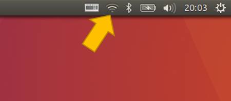
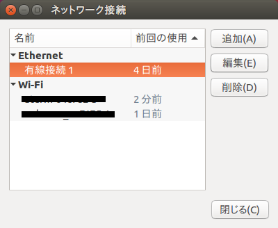
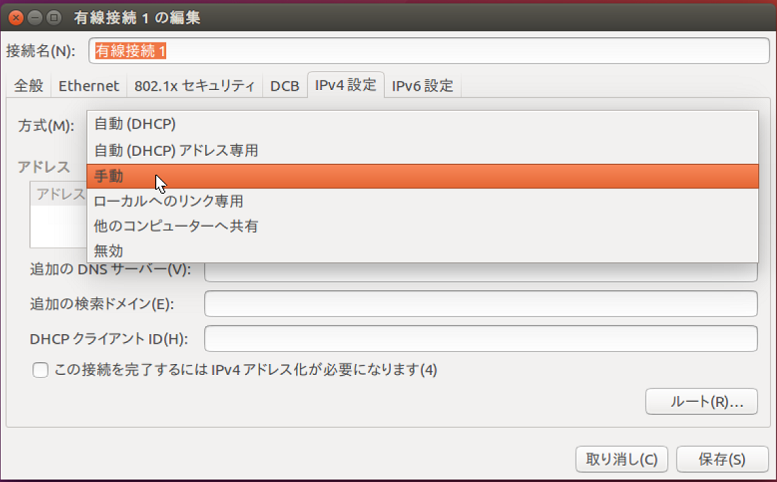
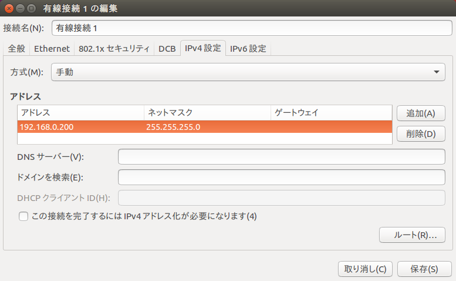
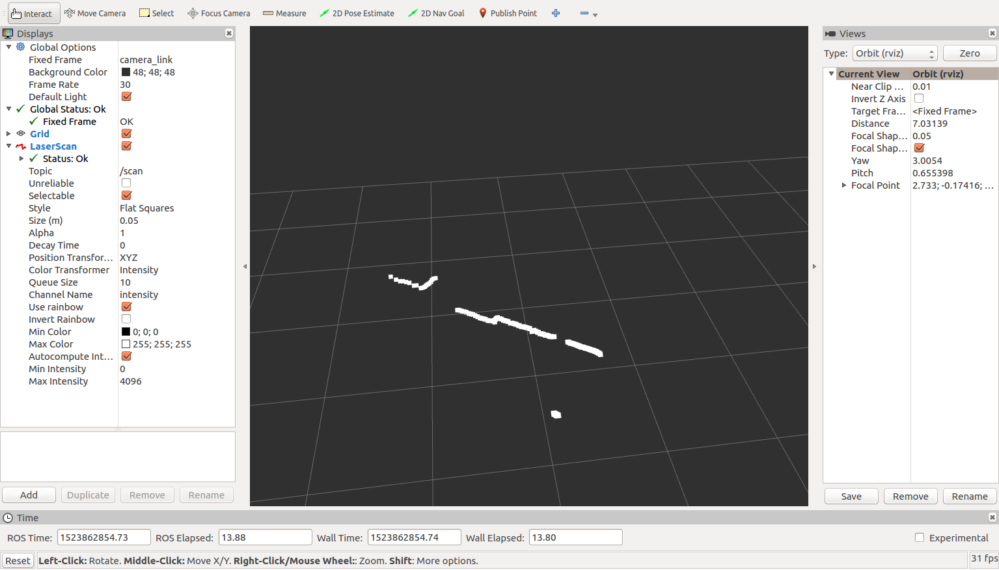

- Table of contents
{:toc}

[YVT-35LX](https://www.hokuyo-aut.co.jp/search/single.php?serial=165) からデータを取得し、2次元点群に変換する方法を説明します。

# 準備
## パッケージのインストール

YVT-35LX を利用するためのパッケージと３次元点群から２次元データに変換するためのパッケージをインストールします。

```shell
$ sudo apt install ros-kinetic-hokuyo3d
```

## launchファイルの入手
点群を3次元から2次元データに変換するパッケージの launch ファイル等をダウンロード

```shell
$ cd ~/catkin_ws/src
$ git clone https://github.com/KMiyawaki/rsj_pointcloud_to_laserscan.git
```

# 動作確認
## ネットワークの設定

1. PC の LAN ポートに YVT-35LX を接続し、バッテリーのスイッチを入れる。

1. 画面右上のネットワークアイコンをクリック  
  

1. 有線接続の項目を選択し、「編集」ボタンをクリック  
  

1. 「IPv4設定」のタブをクリックし、「方式」を手動に設定  
  

1. 「アドレス」の項目で「追加」ボタンをクリックし、アドレス「192.168.0.＊」（＊は10以外の1から255の間の数字）とネットマスクを入力し、最後に「保存」ボタンを押す。  
  

画面に「有線接続完了」の文字が表示されれば完了です。

_注意：無線LANで既に192.168.0.系のネットワークに接続している場合、通信が不通となります。その場合はセンサを接続する前に既存のネットワークから切断してから上記の作業を行ってください。_{:style="color: red"}

## launchファイルの実行

次のコマンドを実行します。

```shell
$ cd ~/catkin_ws/
$ catkin_make
$ source devel/setup.bash
$ roslaunch rsj_pointcloud_to_laserscan rsj_pointcloud_to_laserscan_3durg.launch
```

コンソールに赤字でエラーメッセージが出ていないかどうか確認してください。
もしエラーメッセージが出ていたら、プログラムを __Ctrl+c__{: style="border: 1px solid black" } で終了し、もう一度上記を実行してみてください。

## データの表示

別のコマンドターミナルを開き次を実行してください。

```shell
$ cd ~/catkin_ws/src/rsj_pointcloud_to_laserscan/config/rviz
$ rosrun rviz rviz -d view_scan.rviz
```

下図のように2次元の点群が表示されれば成功です。


