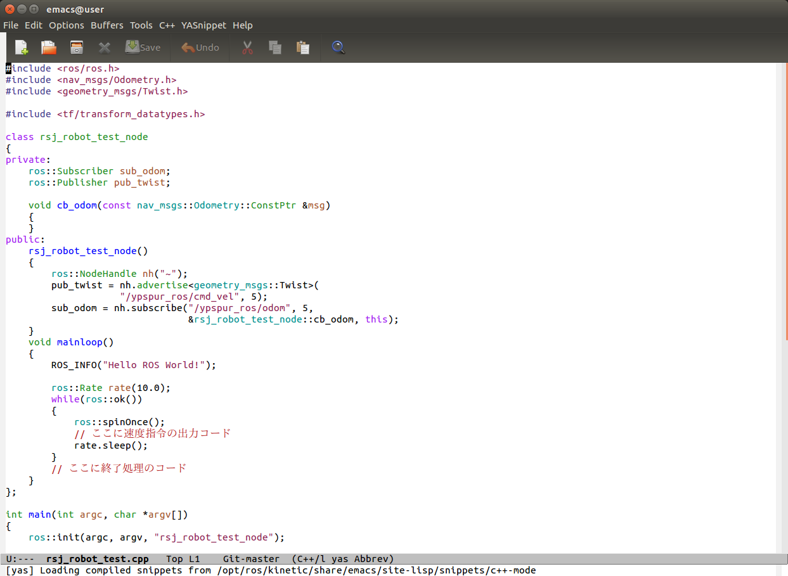

- Table of contents
{:toc}

基本的なROS上で動くプログラムの書き方とビルド方法を学習します。

# 基本的な用語

パッケージ
: ノードや設定ファイル、コンパイル方法などをまとめたもの

ノード
: ROSの枠組みを使用する、実行ファイル

メッセージ
: ノード間でやりとりするデータ

トピック
: ノード間でメッセージをやりとりする際に、メッセージを置く場所

ノード、メッセージ、トピックの関係は以下の図のようにに表せます。


基本的には、ソフトウェアとしての ROS は、ノード間のデータのやりとりをサポートするための枠組みです。
加えて、使い回しがきく汎用的なノードを、世界中の ROS 利用者で共有するコミュニティも、大きな意味でのROSの一部となっています。

# ソースコードを置く場所

ROS では、プログラムをビルドする際に、`catkin`というシステムを使用しています。
また、`catkin`は、`cmake`というシステムを使っており、 ROS 用のプログラムのパッケージ毎に、`cmake`の設定ファイルを作成することで、ビルドに必要な設定を行います。

以下の手順で本作業用の新しいワークスペースを作ります。

```shell
$ mkdir -p ~/catkin_ws/src
$ cd ~/catkin_ws/src
$ catkin_init_workspace
Creating symlink "/home/[ユーザディレクトリ]/catkin/src/CMakeLists.txt"
    pointing to "/opt/ros/kinetic/share/catkin/cmake/toplevel.cmake"
$ ls
CMakeLists.txt
$ cd ..
$ ls
src
$ catkin_make
ase path: /home/【ユーザ名】/catkin_tmp
Source space: /home/【ユーザ名】/catkin_tmp/src
Build space: /home/【ユーザ名】/catkin_tmp/build
Devel space: /home/【ユーザ名】/catkin_tmp/devel
Install space: /home/【ユーザ名】/catkin_tmp/install
・・・
$ ls
build  devel  src
```

`catkin_ws`ディレクトリ内にある、`build`、`devel`は、`catkin`システムがプログラムをビルドする際に使用するものなので、ユーザが触る必要はありません。
`catkin_ws/src`ディレクトリは、 ROS パッケージのソースコードを置く場所で、中にある`CMakeLists.txt` は、ワークスペース全体をビルドするためのルールが書かれているファイルです。

このディレクトリに、`ypspur-coordinator`を ROS に接続するためのパッケージ`ypspur_ros`をダウンロードします。

```shell
$ cd ~/catkin_ws/src
$ git clone https://github.com/openspur/ypspur_ros.git
$ ls
CMakeLists.txt  ypspur_ros
```

git は、ソースコードなどの変更履歴を記録して管理する、分散型バージョン管理システムと呼ばれるものです。
今回のセミナーでは詳細は触れませんが、研究開発を行う上では非常に有用なシステムですので、利用をお勧めします。公式の解説書、[Pro Git](https://git-scm.com/book/ja/v2")などを参考にして下さい。

GitHub は、ソースコードなどのリポジトリーサービスです。
オープンソースソフトウェアの開発、共同作業及び配布を行うためによく利用されて、 ROS ではソースコードの保存と配布する場所としてもっとも人気なサービスです。
バイナリーパッケージとして配布されている ROS パッケージ以外の利用をする場合、 GitHub を利用します。
URL が分かれば上の手順だけで簡単に ROS のパッケージを自分のワークスペースにインポートし利用することができます。

では、次にパッケージのディレクトリ構成を確認します。
ダウンロードしているパッケージがバージョンアップされている場合などには、下記の実行例とファイル名が異なったり、ファイルが追加・削除されているが場合があります。

```shell
$ cd ypspur_ros/
$ ls
CMakeLists.txt  msg  package.xml  src
$ ls msg/
ControlMode.msg  DigitalOutput.msg  JointPositionControl.msg
$ ls src/
getID.sh  joint_tf_publisher.cpp  ypspur_ros.cpp
```

`CMakeLists.txt`と`package.xml`には、使っているライブラリの一覧や、生成する実行ファイルとC++のソースコードの対応など、このパッケージをビルドするために必要な情報が書かれています。
`msg`ディレクトリには、このパッケージ独自のデータ形式の定義が、`src`ディレクトリには、このパッケージに含まれるプログラム(ノード)のソースコードが含まれています。

次に`catkin_make`コマンドで、ダウンロードした`ypspur_ros`パッケージを含む、ワークスペース全体をビルドします。
`catkin_make`は、ワークスペースの最上位ディレクトリ(`~/catkin_ws/`)で行います。

```shell
$ cd ~/catkin_ws/
$ catkin_make
・・・実行結果・・・
```

# ROSノードの理解とビルド・実行

端末を開き、ひな形をダウンロードします。

```shell
$ cd ~/catkin_ws/src/
$ git clone https://github.com/at-wat/rsj_robot_test.git
```

ソースファイルの編集にはお好みのテキストエディターが利用可能です。
本セミナーの説明ではメジャーなテキストエディタである`emacs` を用います。Linuxがはじめての方には`gedit`もおすすめです。

お好みのテキストエディターで`~/catkin_ws/src/rsj_robot_test/src/rsj_robot_test.cpp`を開きます。



## 基本的なコードを読み解く

このコードが実行されたときの流れを確認しましょう。

まず、先頭部分では、必要なヘッダファイルをインクルードしています。

```c++
#include <ros/ros.h>
```

続いて、`rsj_robot_test_node`クラスを定義しています。
ROS プログラミングの際には、基本的にノードの持つ機能をクラスとして定義し、これを呼び出す形式を取ることが標準的です。
クラスを使用せずに書く事も可能ですが、気をつけなければならない点が多くなるため、本セミナーではクラスでの書き方のみを解説します。

```c++
class rsj_robot_test_node
{
 (略)
public:
 (略)
	void mainloop()
	{
		ROS_INFO("Hello ROS World!");

		ros::Rate rate(10.0);
		while(ros::ok())
		{
			ros::spinOnce();
			// ここに速度指令の出力コード
			rate.sleep();
		}
	}
};
```

`rsj_robot_test_node`クラスのメンバ関数である`mainloop`関数の中では、 ROS で情報を画面などに出力する際に用いる、`ROS_INFO`関数を呼び出して、`"Hello ROS World!"`と表示しています。
ほかにも、`ROS_DEBUG`、`ROS_WARN`、`ROS_ERROR`、`ROS_FATAL`関数が用意されています。

`ros::Rate rate(10.0)`で、周期実行のためのクラスを初期化しています。
初期化時の引数で実行周波数(この例では10Hz)を指定します。

`while(ros::ok())`で、メインの無限ループを回します。
`ros::ok()`を`while`の条件にすることで、ノードの終了指示が与えられたとき( __Ctrl+c__{: style="border: 1px solid black" } が押された場合も含む)には、ループを抜けて終了処理などが行えるようになっています。

ループ中では、まず、`ros::spinOnce()`を呼び出して、 ROS のメッセージを受け取るといった処理を行います。
`spinOnce`は、その時点で届いているメッセージの受け取り処理を済ませた後、すぐに処理を返します。
`rate.sleep()`は、先ほど初期化した実行周波数を維持するように`sleep`します。

なお、ここでは、クラスを定義しただけなので、中身が呼び出されることはありません。後ほど実体化されたときに、初めて中身が実行されます。

続いて、 C++ の`main`関数が定義されています。
ノードの実行時には、ここから処理がスタートします。

```c++
int main(int argc, char **argv) {
	ros::init(argc, argv, "rsj_robot_test_node");
	
	rsj_robot_test_node robot_test;
	
	robot_test.mainloop();
}
```

はじめに、`ros::init`関数を呼び出して、 ROS ノードの初期化を行います。
1、2番目の引数には`main`関数の引数をそのまま渡し、3番目の引数には、このノードの名前(この例では`"rsj_robot_test_node"`)を与えます。

次に、`rsj_robot_test_node`クラスの実体を作成します。
ここでは、`robot_test`と名前をつけています。

最後に、実体化した`robot_test`のメンバ関数、`mainloop`を呼び出します。
`mainloop`関数の中は無限ループになっているため、終了するまでの間、`ros::spinOnce()`、`rate.sleep()`が呼び出され続けます。

つまり、`rsj_robot_test`は特に仕事をせず、`"Hello ROS World!"`と画面に表示します。

## ビルド＆実行

ROS 上でこのパッケージをビルドするためには、`catkin_make`コマンドを用います。

```shell
$ cd ~/catkin_ws/
$ catkin_make
```

端末で実行してみましょう。

ROS システムの実行の際、 ROS を通してノード同士がデータをやりとりするために用いる、`roscore`を起動しておく必要があります。
2つ目の端末を開き、それぞれで以下を実行して下さい。

1つ目の端末：

```shell
$ roscore
```

ROS でワークスペースを利用するとき、端末でそのワークスペースをアクティベートすることが必要です。
このためにワークスペースの最上のディレクトリで`source devel/setup.bash`を実行します。
このコマンドはワークスペースの情報を利用中の端末に読み込みます。
しかし、 _仮のことだけ_ ので必ず新しい端末でワークスペースを利用し始めると _必ず_{: style="color: red"} まずは`source devel/setup.bash`を実行しなければなりません。
一つの端末で一回だけ実行すれば十分です。その端末を閉じるまでに有効です。

2つ目の端末で下記を実行します。

```shell
$ cd ~/catkin_ws/
$ source devel/setup.bash
$ rosrun rsj_robot_test rsj_robot_test_node
[ INFO] [1466002781.136800000]: Hello ROS World!
```

`Hello ROS World!`と表示されれば成功です。
以上の手順で、 ROS パッケージに含まれるノードのソースコードを編集し、ビルドして、実行できるようになりました。

両方の端末で __Ctrl+c__{: style="border: 1px solid black" } でノードと`roscore`を終了します。

## ロボットに速度指令を与える

まず、ロボットに速度指令(目標並進速度・角速度)を与えるコードを追加します。
ひな形には既に、速度指令値が入ったメッセージを出力するための初期化コードが含まれていますので、この部分の意味を確認します。

```c++
rsj_robot_test_node():
{
	ros::NodeHandle nh("~");
	pub_twist = nh.advertise<geometry_msgs::Twist>(
			"/ypspur_ros/cmd_vel", 5);
	sub_odom = nh.subscribe("/ypspur_ros/odom", 5,
			&rsj_robot_test_node::cb_odom, this);
}
```

ソースコード中の、`rsj_robot_test_node`クラスの、`rsj_robot_test_node`関数は、クラスのコンストラクタと呼ばれるもので、クラスが初期化されるときに自動的に呼び出されます。
この中で、

```c++
nh.advertise<geometry_msgs::Twist>("/ypspur_ros/cmd_vel", 5);
```

の部分で、このノードが、<u>これからメッセージを出力する</u>ことを宣言しています。`advertise`関数に与えている引数は以下のような意味を持ちます。

`"/ypspur_ros/cmd_vel"`
: 出力するメッセージを置く場所(トピックと呼ぶ)を指定

`5`
: メッセージのバッファリング量を指定 (大きくすると、処理が一時的に重くなったときなどに受け取り側の読み飛ばしを減らせる)

`advertise` 関数についている `<geometry_msgs::Twist>` の部分は、メッセージの型を指定しています。
これは、幾何的・運動学的な値を扱うメッセージを定義している `geometry_msgs` パッケージの、並進・回転速度を表す `Twist` 型です。
この指定方法は、 C++ のテンプレートという機能を利用していますが、ここでは「 `advertise` のときはメッセージの型指定を `< >` の中に書く」とだけ覚えておけば問題ありません。

以下のコードを、`mainloop`関数の中(「ここに速度指令の出力コード」の部分)に入れることで、速度指令のメッセージを出力(`publish`)します。

```c++
geometry_msgs::Twist cmd_vel;
cmd_vel.linear.x = 0.05;
cmd_vel.angular.z = 0.0;
pub_twist.publish(cmd_vel);
```

## ビルド＆実行
```shell
$ cd ~/catkin_ws/
$ catkin_make
```

この際、ビルドエラーが出ていないか、良く確認して下さい。エラーが出ている場合は、ソースコードの該当箇所を確認・修正して下さい。

実行の際、まず `roscore` と、 `ypspur_ros` を起動します。 `ypspur_ros` の中では、ロボットの動作テストの際に使用した、 `ypspur-coordinator` が動いています。
なお、 `roscore` は、前のものを実行し続けている場合は、そのままで使用できます。コマンド入力の際は、タブ補完を活用しましょう。

```shell
$ roscore
```

2番目の端末を開いて、下記を実行します。

```shell
$ cd ~/catkin_ws/
$ source devel/setup.bash
$ rosrun ypspur_ros ypspur_ros _param_file:=/home/【ユーザ名】/params/rsj-seminar20??.param <u>該当するものに置き換えること</u> _port:=/dev/serial/by-id/usb-T-frog_project_T-frog_Driver-if00
```

続いて、別の端末でrsj_robot_test_nodeノードを実行します。まずは、ロボットのホイールを浮かせて、走り出さない状態にして実行してみましょう。

```shell
$ cd ~/catkin_ws/
$ source devel/setup.bash
$ rosrun rsj_robot_test rsj_robot_test_node
Hello ROS World!
```

ゆっくりとホイールが回れば、正しく動作しています。 __Ctrl+c__{: style="border: 1px solid black" } で終了します。

# 小課題(1)

速度、角速度を変更して動作を確認してみましょう。

## ロボットの状態を表示する
### ロボットの状態を表示するコードを追加

まず、ロボットの動作したときの移動量やオドメトリ座標を取得、表示するコードを追加します。
ひな形には既に、移動量や座標が入ったメッセージを受け取るコードが含まれていますので、この部分の意味を確認します。

```c++
rsj_robot_test_node():
{
	ros::NodeHandle nh("~");
	pub_twist = nh.advertise<geometry_msgs::Twist>(
			"/ypspur_ros/cmd_vel", 5);
	sub_odom = nh.subscribe("/ypspur_ros/odom", 5,
			&rsj_robot_test_node::cb_odom, this);
}
```

この中で

```c++
nh.subscribe("/ypspur_ros/odom", 5, &rsj_robot_test_node::cb_odom, this);
```

の部分で、このノードが、これからメッセージを受け取ることを宣言しています。
`subscribe`関数に与えている引数は以下のような意味を持ちます。

`"/ypspur_ros/odom"`
: 受け取るメッセージが置かれている場所(トピック)を指定

`5`
: メッセージのバッファリング量を指定 (大きくすると、処理が一時的に重くなったときなどに受け取り側の読み飛ばしを減らせる)

`&rsj_robot_test_node::cb_odom`
: メッセージを受け取ったときに呼び出す関数を指定 (rsj_robot_test_nodeクラスの中にある、cb_odom関数)

`this`
: メッセージを受け取ったときに呼び出す関数がクラスの中にある場合にクラスの実体を指定 (とりあえず、おまじないと思って構いません。)

これにより、`rsj_robot_test_node`ノードは、`/odom`トピックからメッセージをうけとると、`cb_odom`関数が呼び出されるようになります。

続いて`cb_odom`関数の中身を確認しましょう。

```c++
void cb_odom(const nav_msgs::Odometry::ConstPtr &msg)
{
}
```

`const nav_msgs::Odometry::ConstPtr`は、`const`型(内容を書き換えられない)、`nav_msgs`パッケージに含まれる、`Odometry`型のメッセージの、`const`型ポインタを表しています。
`&msg`の`&`は、参照型(内容を書き換えられるように変数を渡すことができる)という意味ですが、(`const`型なので)ここでは特に気にする必要はありません。

`cb_odom`関数に、以下のコードを追加してみましょう。
これにより、受け取ったメッセージの中から、ロボットの並進速度を取り出して表示できます。

```c++
ROS_INFO("vel %f", msg->twist.twist.linear.x);
```

ここで、`msg->twist.twist.linear.x`の意味を確認します。
`nav_msgs::Odometry`メッセージには、下記のように入れ子状にメッセージが入っています。

```shell
std_msgs/Header header
string child_frame_id
geometry_msgs/PoseWithCovariance pose
geometry_msgs/TwistWithCovariance twist
```

全て展開すると、以下の構成になります。

```shell
std_msgs/Header header
uint32 seq
time stamp
string frame_id
string child_frame_id
geometry_msgs/PoseWithCovariance pose
geometry_msgs/Pose pose
geometry_msgs/Point position
float64 x
float64 y
float64 z
geometry_msgs/Quaternion orientation
float64 x
float64 y
float64 z
float64 w
float64[36] covariance
geometry_msgs/TwistWithCovariance twist
geometry_msgs/Twist twist
geometry_msgs/Vector3 linear
float64 x ロボット並進速度
float64 y
float64 z
geometry_msgs/Vector3 angular
float64 x
float64 y
float64 z ロボット角速度
float64[36] covariance
```

読みたいデータである、ロボット並進速度を取り出すためには、これを順にたどっていけば良く、`msg->twist.twist.linear.x`となります。
`msg`はクラスへのポインタなので「`->`」を用い、以降はクラスのメンバ変数へのアクセスなので「`.`」を用いてアクセスしています。

### ビルド＆実行
```shell
$ cd ~/catkin_ws/
$ catkin_make
```

この際、ビルドエラーが出ていないか、良く確認して下さい。エラーが出ている場合は、ソースコードの該当箇所を確認・修正して下さい。

まず、先ほどと同様、`roscore`と、`ypspur_ros`を起動します(以降、この手順の記載は省略します)。

```shell
$ roscore
```

2番目の端末を開いて、下記を実行します。

```shell
$ cd ~/catkin_ws/
$ source devel/setup.bash
$ rosrun ypspur_ros ypspur_ros _param_file:=/home/【ユーザ名】/params/rsj-seminar20??.param <u>該当するものに置き換えること</u> _port:=/dev/serial/by-id/usb-T-frog_project_T-frog_Driver-if00
```

続いて、`rsj_robot_test_node`ノードを実行します。

```shell
$ cd ~/catkin_ws/
$ source devel/setup.bash
$ rosrun rsj_robot_test rsj_robot_test_node
Hello ROS World!
vel: 0.0500
vel: 0.0500
vel: 0.0500
vel: 0.0500
```

ロボットのホイールが回転し、先ほどの小課題で設定した走行指令の値と近い値が表示されれば、正しく動作しています。

# 小課題(2)
同様に、ロボットの角速度を表示してみましょう。

## シーケンス制御
###時間で動作を変える
メインループを以下のように変更してみましょう。

```c++
void mainloop()
{
	ROS_INFO("Hello ROS World!");

	ros::Rate rate(10.0);
	ros::Time start = ros::Time::now();
	while(ros::ok())
	{
		ros::spinOnce();
		ros::Time now = ros::Time::now();

		geometry_msgs::Twist cmd_vel;
		if(now - start > ros::Duration(3.0))
		{
			cmd_vel.linear.x = 0.05;
			cmd_vel.angular.z = 0.0;
		}
		pub_twist.publish(cmd_vel);

		rate.sleep();
	}
}
```

これは、メインループ開始時刻から、3.0秒後に、並進速度0.05m/sの指令を与えるコードです。
`ros::Time`型(時刻を表す)同士の減算結果は、`ros::Duration`型(時間を表す)になり、比較演算子で比較できます。
したがって、`now - start > ros::Duration(3.0)`の部分は、開始から3秒後に、`true`になります。

先ほどと同様にビルドし、`ypspur_ros`と`rsj_robot_test_node`を起動して動作を確認します。

### センシング結果で動作を変える

`cb_odom`で取得したオドメトリのデータを保存しておくように、以下のように変更してみましょう。

```c++
void cb_odom(const nav_msgs::Odometry::ConstPtr &msg)
{
	ROS_INFO("vel %f", msg->twist.twist.linear.x);
	odom = *msg; //追記
}
```

また、`class rsj_robot_test_node`の先頭に下記の変数定義を追加します。

```c++
class rsj_robot_test_node
{
private:
	nav_msgs::Odometry odom;
```

また、`odom`の中で方位を表すクオータニオンを、コンストラクタ(`rsj_robot_test_node()`関数)の最後で初期化しておきます。

```c++
rsj_robot_test_node():
{
	(略)
	odom.pose.pose.orientation.w = 1.0;
}
```

メインループを以下のように変更してみましょう。

```c++
void mainloop()
{
	ROS_INFO("Hello ROS World!");

	ros::Rate rate(10.0);
	while(ros::ok())
	{
		ros::spinOnce();

		geometry_msgs::Twist cmd_vel;
		if(tf::getYaw(odom.pose.pose.orientation) > 1.57)
		{
			cmd_vel.linear.x = 0.0;
			cmd_vel.angular.z = 0.0;
		}
		else
		{
			cmd_vel.linear.x = 0.0;
			cmd_vel.angular.z = 0.1;
		}
		pub_twist.publish(cmd_vel);

		rate.sleep();
	}
}
```

これは、オドメトリの Yaw 角度(旋回角度)が1.57ラジアン(90度)を超えるまで、正方向に旋回する動作を表しています。

先ほどと同様にビルドし、`ypspur_ros`と`rsj_robot_test_node`を起動して動作を確認します。

# 小課題(3)

1m 前方に走行し、その後で帰ってくるコードを作成してみましょう。
(1m 前方に走行し 180 度旋回して 1m 前方に走行するか、 1m 前方に走行し1m後方に走行すればよい。)

余裕があれば、四角形を描いて走行するコードを作成してみましょう。
