- Table of contents
{:toc}

地図作成と、簡易的に調整済みの navigation パッケージを利用して、自律ナビゲーションを体験します。

# ROS navigationパッケージとは

`navigation`パッケージは、自己位置推定、大域的な経路計画、局所的な動作計画など、地図ベースの自律走行に必要なノードを含むパッケージ群で、世界中の ROS 開発者によって作成・管理されています。

世界中の英知の塊とも言える`navigation`パッケージですが、含まれるソフトウェアの内ではアドホックな構造やパラメータが多数あり、まともに動く(例えばつくばチャレンジを走破する)ようにチューニングするのは(これら全てを自分で実装できるくらいの)知識と経験が必要です。

本セミナーでは、地図作成と自律ナビゲーションを簡易的に調整済みの`launch`ファイルを利用して動作させます。

# 必要なパッケージのインストール

下記コマンドを用いて地図生成に用いる`slam_gmapping`パッケージと、マウスでロボットを操縦する`mouse_teleop`パッケージをインストールします。

navigation パッケージはサイズが非常に大きいため、ダウンロードに時間がかかることがあります。
[準備のページ](linux_and_ros_install.html)に同様の手順を書いていますので、すでにインストールされている方はこの手順は不要です。

```shell
$ sudo apt-get install ros-kinetic-slam-gmapping ros-kinetic-mouse-teleop
```

また、セミナー教材用にパラメータを調整してある地図生成や自律ナビゲーションの`launch`ファイルが入ったパッケージをダウンロードします。

```shell
$ cd ~/catkin_ws/src/
$ git clone https://github.com/at-wat/rsj_seminar_navigation
```

ダウンロードした`rsj_seminar_navigation`パッケージを`catkin_make`でビルドします。

```shell
$ cd ~/catkin_ws/
$ catkin_make
```

# 地図生成
まず、地図ベースの自律ナビゲーションを実現するために`slam_gmapping`パッケージを用いて地図を作成します。

PC にロボットと URG の USB ケーブルを接続し、地図を生成したい場所にロボットを置いて、下記のコマンドを実行します。
ただし利用するセンサに応じてコマンドが異なりますのでご注意ください。

## URG-04LX-UG01 の場合
```shell
$ cd ~/catkin_ws/
$ source devel/setup.bash
$ roslaunch rsj_seminar_navigation mapping.launch robot_param:=/home/【ユーザ名】/params/rsj-seminar20??.param該当するものに置き換えること
```
## YVT-35LX の場合
？？？

## Xtion PRO Live の場合
```shell
$ cd ~/catkin_ws/
$ source devel/setup.bash
$ roslaunch rsj_seminar_navigation xtion_mapping.launch robot_param:=/home/【ユーザ名】/params/rsj-seminar20??.param該当するものに置き換えること
```

RViz が起動し、下記のように複数の URG もしくは Xtion のスキャンデータをつなげて、大きな占有格子地図を生成し始めます。

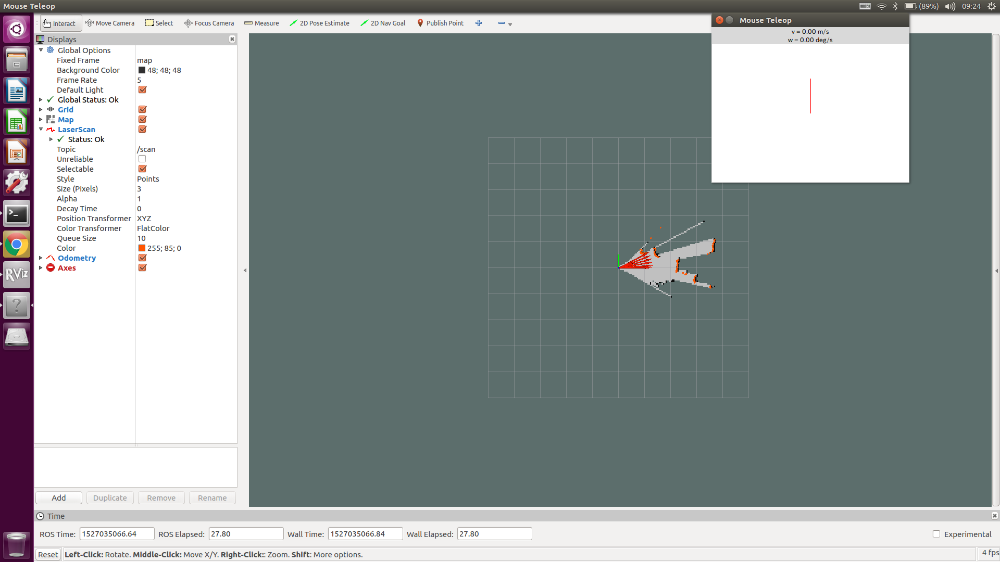

「`Mouse Teleop`」のウインドウ内をマウスでドラッグ操作することでロボットの動作を制御できますので、地図を作りたい範囲を移動させてみましょう。
「`Mouse Teleop`」のウインドウが隠れている場合は、左の「？」アイコンをクリックすることで最前面に表示できます。

この地図生成は、 URG や Xtion のスキャンデータを逐次つなげていく仕組みのため、ロボットの位置姿勢を大きく変化させた場合やセンサに見えているものが少ない場合には、地図が破綻する場合があります。

その際は、`roslaunch`を実行した端末で、 __Ctrl+c__{: style="border: 1px solid black" } を押して終了し、もう一度実行し直します。

ロボットを走行させていくと、図のように走行させた範囲の地図が表示されます。

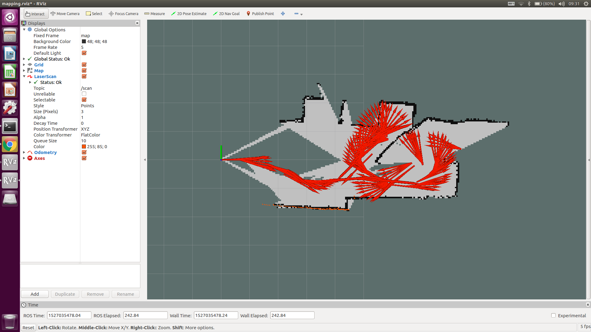

必要な範囲の地図ができあがったら端末をもう一つ開き、下記のコマンドで保存するディレクトリを作成し、地図データをファイルに出力します。

```shell
$ mkdir ~/maps
$ cd ~/maps/
$ rosrun map_server map_saver
```

画面左の「ファイル」アイコンから、ホームディレクトリ下の、「`maps`」ディレクトリを見ると、`map.yaml`と、`map.pgm`ファイルが生成されていることが確認できます。

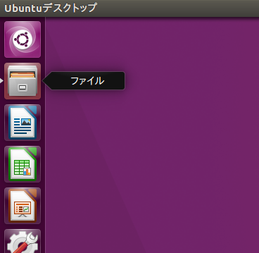

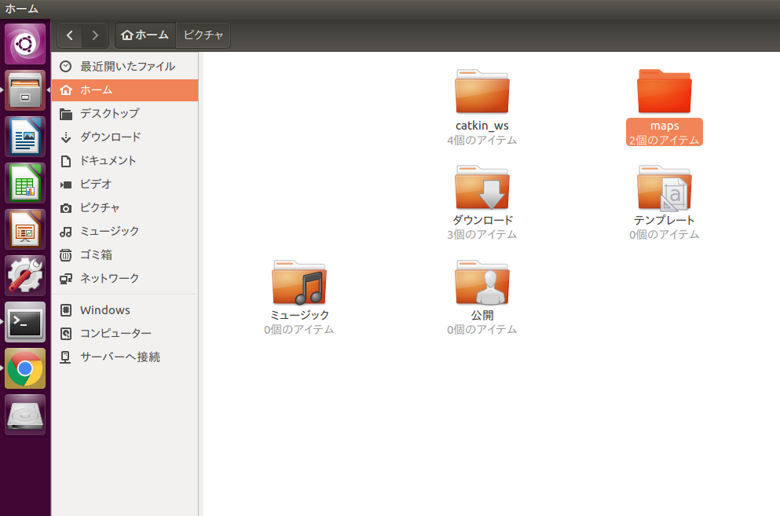

`map.yaml`をダブルクリックして開くと、地図の解像度や原点の情報が書かれています。
また、`map.pgm`を開くと地図データが画像ファイルとして保存されていることがわかります。

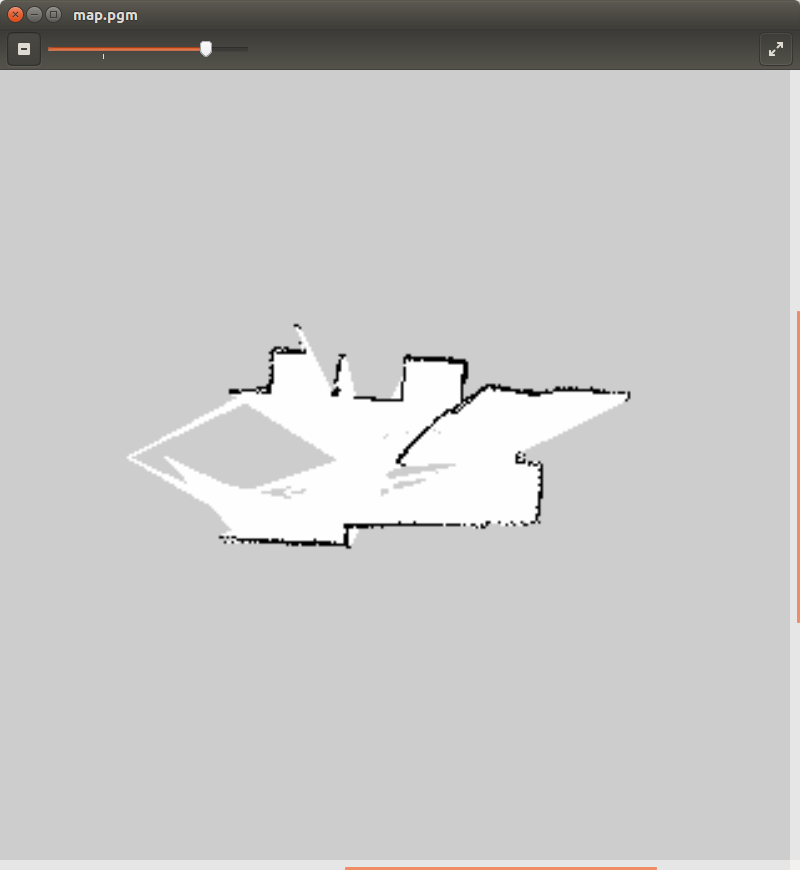

地図の画像ファイルが正しく出力できていることを確認したら、`roslaunch`を実行した端末のウインドウを選択して、 __Ctrl+c__{: style="border: 1px solid black" } を押して終了します。

# ナビゲーション
先ほど作成した地図を用いて、自律ナビゲーションを試してみましょう。

PC にロボットと URG や Xtion の USB ケーブルを接続し、地図を作成した際の初期位置・姿勢と同じようにロボットを置いて、下記のコマンドを実行します。

## URG-04LX-UG01 の場合
```shell
$ cd ~/catkin_ws/
$ source devel/setup.bash
$ roslaunch rsj_seminar_navigation navigation.launch robot_param:=/home/【ユーザ名】/params/rsj-seminar20??.param該当するものに置き換えること
```
## YVT-35LX の場合
？？？

## Xtion PRO Live の場合
```shell
$ cd ~/catkin_ws/
$ source devel/setup.bash
$ roslaunch rsj_seminar_navigation xtion_navigation.launch robot_param:=/home/【ユーザ名】/params/rsj-seminar20??.param該当するものに置き換えること
```

RViz が起動し、下記のように先ほど作成した地図が表示されます。
この例では、地図と、オレンジ色でプロットされている URG や Xtion の現在のデータがずれており、自己位置がずれていることがわかります。
また、水色のたくさんの矢印は、推定している自己位置の候補を表しています。

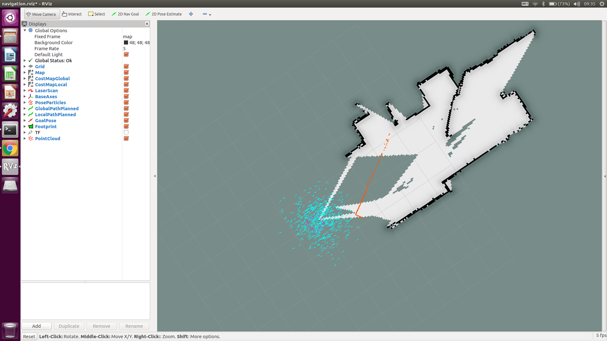

RViz のウインドウ上中央にある、「`2D Pose Estimate`」ボタンを押し、ロボットの本来の位置からロボットの向いている方向に向かってドラッグすると、緑色の矢印が現れ自己位置推定ノードに位置姿勢の修正を指示することができます。

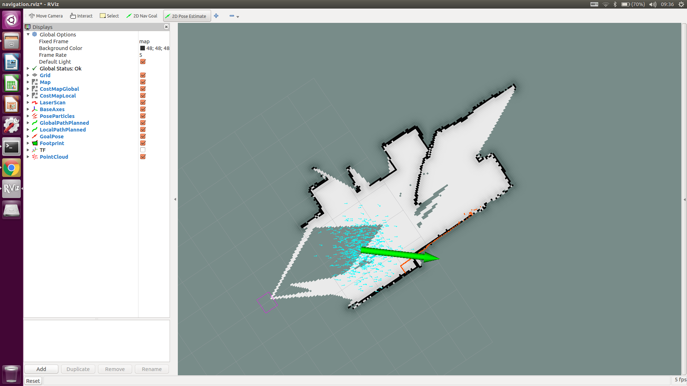

地図と、 URG や Xtion のデータが概ね一致しました。

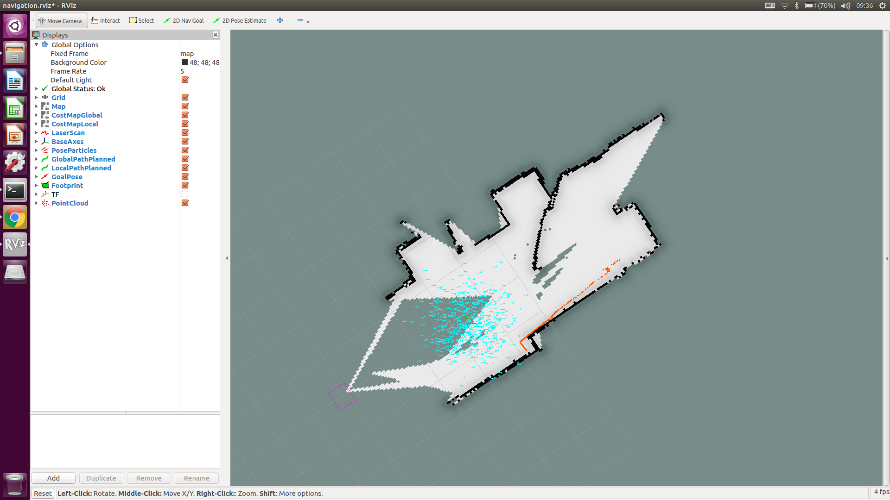

次に、ウインドウ上中央の「`2D Nav Goal`」ボタンでナビゲーションのゴールを指定します。
同様に、与えたいゴールの位置から目標姿勢の方向に向かってドラッグすると、緑色の矢印が現れナビゲーションのノードに目標位置姿勢の指示を与えることができます。

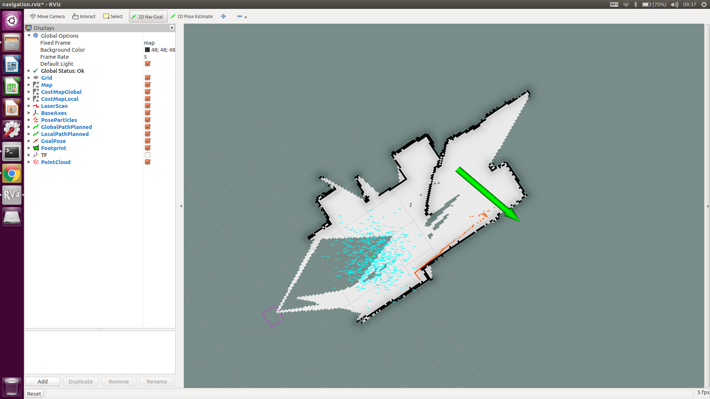

すると、緑色の線でグローバルプランナーが生成したパス、赤色の線でローカルプランナーが生成したパスが表示され、ロボットが走行を開始します。

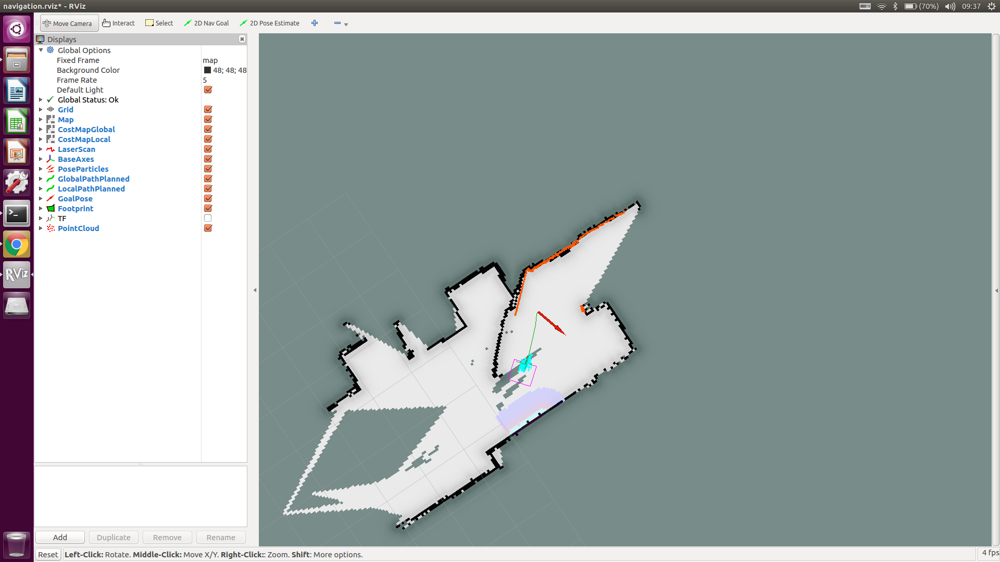

走行していくと、水色の矢印で表された自己位置の候補の分布が小さくなり、自己位置推定の確度が高くなったことが確認できます。

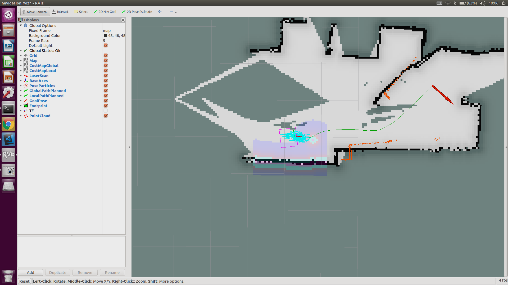

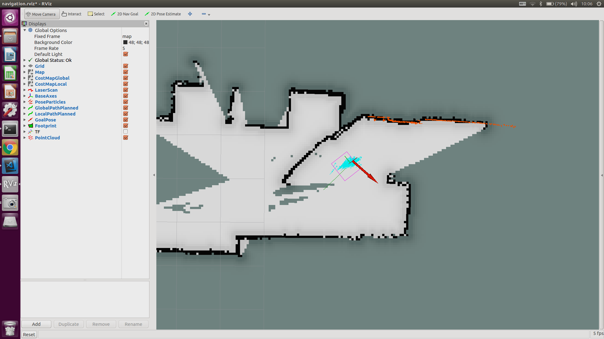

ゴールに到着し、姿勢を目標の方向に向けると動作が終了します。

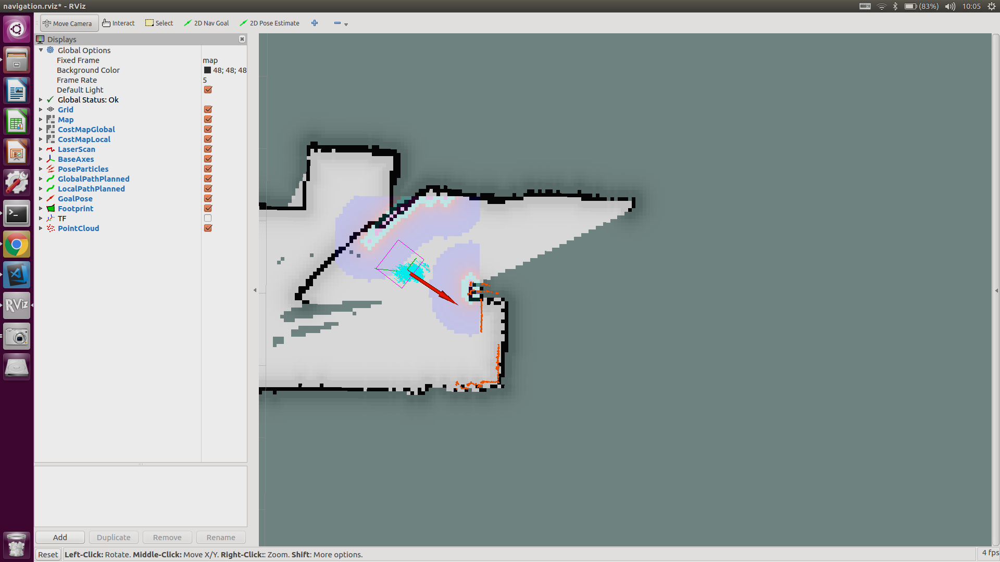

この状態で、どのようなノードが立ち上がっているのか確認してみましょう。
新しい端末を開き、`rqt_graph`を実行します。

```shell
$ rqt_graph
```

左上の「`Nodes only`」の部分で「`Nodes/Topics (active)`」を選択します。

Xtion を使っていた場合は次のような図が表示されます。
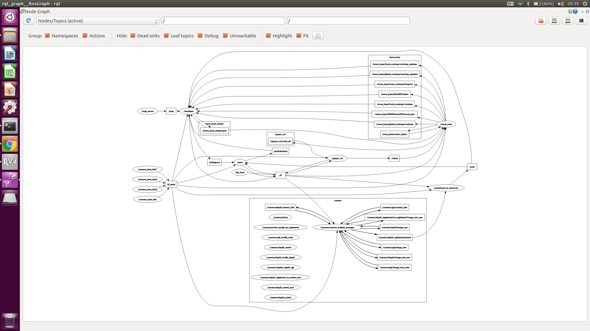

URG を使っていた場合は次のような図が表示されます。

？？？？？

3DURG を使っていた場合は次のような図が表示されます。

？？？？？

四角枠で書かれた名前はトピック、もしくは複数のノードをグループ化したもの（`nodelet`）を表しています。
丸枠で書かれた名前はノードを表しており、下記の仕事をしています。

`ypspur_ros`
: ロボットの制御

`urg_node`
: URG データの取り込み

`"/camera"`で始まるノード群
: Xtion データの取り込み

`pointcloud_to_laserscan`
: 3次元点群を2次元データに変換する

`map_server`
: 地図ファイルの読み取り

`amcl`
: 自己位置推定(モンテカルロローカライゼーション、いわゆる、パーティクルフィルター)

`move_base`
: ナビゲーション(プラグインで、ダイクストラ法のグローバルプランナーと、ダイナミックウインドウアプローチのローカルプランナー、2Dコストマップの処理を実行)

`visualizer`
: データの可視化( RViz )

`stp_laser`
: ロボットの座標原点とURGの座標原点の座標変換の定義

# 小課題
`rsj_seminar_navigation`パッケージの`launch`ファイルの中身を開き、どのようなノードが実行されているのか講義の内容と照らし合わせて確認してみましょう。